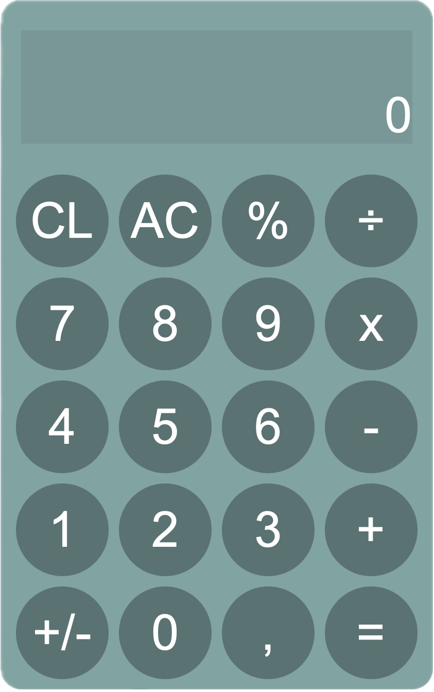

# Calculator

A simple calculator built with HTML, CSS, and JavaScript as part of [The Odin Project](https://www.theodinproject.com/) curriculum.

## Table of Contents

- [Overview](#overview)
- [Features](#features)
- [Technologies](#technologies)
- [Installation](#installation)
- [Usage](#usage)
- [Screenshots](#screenshots)
- [Project Status](#project-status)
- [Acknowledgments](#acknowledgments)

## Overview

This project is a fully functional calculator application developed with HTML, CSS, and JavaScript. It covers fundamental programming concepts such as DOM manipulation, event handling, and basic arithmetic operations.

## Features

- Basic arithmetic operations: addition, subtraction, multiplication, and division
- Keyboard support for number and operation inputs
- Clear and backspace functionalities
- Responsive design for various screen sizes

## Technologies

- **HTML**: Markup structure
- **CSS**: Styling and layout
- **JavaScript**: Logic and functionality

## Installation

To use this project locally, follow these steps:

1. Clone the repository:

   ```bash
   git clone https://github.com/davidlovcov/calculator.git

   ```

2. Open the project folder:

   ```bash
   cd calculator

   ```

3. Open the index.html file in your web browser:
   ```bash
   open index.html
   ```

Or, if you have a live server extension in your code editor, you can run the project directly from there.

## Usage

1. Enter numbers and operators using the on-screen buttons or your keyboard.
2. Click `=` or press `Enter` to see the result.
3. Use `C` to clear the display or `←` (backspace) to delete the last entry.

## Screenshots



## Project Status

The project is complete but may receive future updates for additional features and improvements.

## Acknowledgments

This project was created as part of [The Odin Project](https://www.theodinproject.com/) curriculum, a free, open-source web development course.
